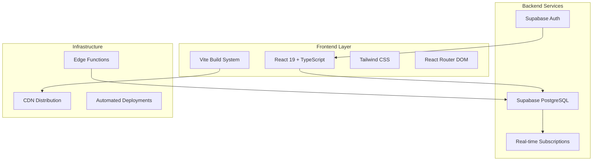

# 🌿 360 Sustainability Insights

[](https://typescriptlang.org/)
[](https://reactjs.org/)
[](https://vitejs.dev/)
[](https://tailwindcss.com/)
[](https://supabase.com/)

> **A comprehensive sustainability profiling platform that empowers consumers and organizations to make informed decisions based on real environmental, labor, and animal welfare data.**

**360 Sustainability Insights** transforms the complex landscape of corporate sustainability into accessible, actionable intelligence. Built with modern web technologies and real-time data processing, this platform provides transparency into how brands perform across critical sustainability dimensions.

---

## 🎯 **Overview**

In an era where sustainability is paramount, **360** bridges the gap between corporate claims and verifiable data. Our platform aggregates, analyzes, and presents sustainability metrics in an intuitive dashboard that serves researchers, consumers, and business stakeholders.

### **Key Value Propositions**

- **🔍 Transparency First**: Real-time access to verified sustainability scores across multiple dimensions
- **📊 Data-Driven Insights**: Comprehensive scoring system covering environmental impact, labor practices, and animal welfare
- **🚀 Modern Performance**: Built with cutting-edge tech stack for blazing-fast user experience
- **🎨 Intuitive Design**: Clean, accessible interface designed for both technical and non-technical users
- **🔄 Real-time Updates**: Live data synchronization with robust backend infrastructure

---

## ✨ **Features**

### **Core Functionality**

| Feature | Description | Status |
|---------|-------------|--------|
| **Brand Dashboard** | Comprehensive view of all tracked brands with filtering and sorting | ✅ Production Ready |
| **Sustainability Scoring** | Multi-dimensional scoring system (Environment, Labor, Animals, Overall) | ✅ Production Ready |
| **Interactive Filtering** | Dynamic filtering by minimum scores and sorting preferences | ✅ Production Ready |
| **Detailed Brand Profiles** | In-depth analysis of individual brand performance | ✅ Production Ready |
| **Responsive Design** | Optimized experience across desktop, tablet, and mobile devices | ✅ Production Ready |
| **Performance Monitoring** | Real-time performance tracking and optimization | ✅ Production Ready |

### **Advanced Capabilities**

- **🔄 Real-time Data Sync**: Automatic updates from multiple data sources
- **📱 Progressive Web App**: Offline-capable, app-like experience
- **🎯 Smart Filtering**: Advanced filtering and search capabilities
- **📈 Trend Analysis**: Historical data tracking and trend visualization
- **🔐 Secure Architecture**: Enterprise-grade security with Supabase Auth
- **⚡ Edge Computing**: Global CDN distribution for optimal performance

---

## 🏗️ **Technical Architecture**

### **Technology Stack**



### **Core Technologies**

| Layer | Technology | Version | Purpose |
|-------|------------|---------|---------|
| **Frontend** | React | 19.1.0 | Component-based UI framework |
| **Build System** | Vite | 7.0.4 | Next-generation frontend tooling |
| **Language** | TypeScript | 5.8.3 | Type-safe development |
| **Styling** | Tailwind CSS | 3.4.1 | Utility-first CSS framework |
| **Routing** | React Router | 7.7.1 | Client-side routing |
| **Backend** | Supabase | 2.53.0 | Backend-as-a-Service platform |
| **Database** | PostgreSQL | Latest | Relational database via Supabase |

### **Database Schema**

```sql
-- Brands table: Core brand information
CREATE TABLE brands (
    id SERIAL PRIMARY KEY,
    name VARCHAR(255) NOT NULL UNIQUE,
    logo_url TEXT,
    website TEXT,
    created_at TIMESTAMP DEFAULT NOW()
);

-- Sustainability scores: Multi-dimensional scoring system
CREATE TABLE sustainability_scores (
    id SERIAL PRIMARY KEY,
    brand_id INTEGER REFERENCES brands(id) ON DELETE CASCADE,
    score_overall INTEGER CHECK (score_overall >= 0 AND score_overall <= 100),
    score_environment INTEGER CHECK (score_environment >= 0 AND score_environment <= 100),
    score_labor INTEGER CHECK (score_labor >= 0 AND score_labor <= 100),
    score_animals INTEGER CHECK (score_animals >= 0 AND score_animals <= 100),
    updated_at TIMESTAMP DEFAULT NOW(),
    UNIQUE(brand_id)
);
```

---

## 🚀 **Quick Start**

### **Prerequisites**

- **Node.js** 18.0+ ([Download](https://nodejs.org/))
- **npm** 8.0+ (comes with Node.js)
- **Supabase Account** ([Sign up](https://supabase.com/))

### **Installation**

```bash
# Clone the repository
git clone https://github.com/santoshD93/360-sustainability-demo.git
cd 360-sustainability-demo

# Navigate to frontend directory
cd frontend

# Install dependencies
npm install

# Set up environment variables
cp .env.example .env
```

### **Environment Configuration**

Create a `.env` file in the `frontend` directory:

```bash
# Supabase Configuration
VITE_SUPABASE_URL=your_supabase_project_url
VITE_SUPABASE_ANON_KEY=your_supabase_anon_key
```

> **⚠️ Security Note**: Never commit your actual environment variables to version control.

### **Database Setup**

1. **Create Supabase Project**: Visit [Supabase Dashboard](https://app.supabase.com/)
2. **Set up Tables**: Use the schema provided in the Technical Architecture section
3. **Configure RLS**: Set up Row Level Security policies as needed
4. **Seed Data**: Run the provided seed scripts

```bash
# Seed the database with sample data
npm run seed:brands
npm run seed:scores
```

### **Development Server**

```bash
# Start development server
npm run dev

# Server will be available at http://localhost:5173
```

### **Production Build**

```bash
# Build for production
npm run build

# Preview production build locally
npm run preview
```

---

## 📊 **Project Structure**

```
frontend/
├── public/                 # Static assets
├── src/
│   ├── components/        # Reusable UI components
│   │   └── Navbar.tsx    # Navigation component
│   ├── pages/            # Route-based page components
│   │   ├── Home.tsx      # Landing page
│   │   ├── BrandList.tsx # Brand catalog with filtering
│   │   └── BrandScores.tsx # Individual brand details
│   ├── api/              # API integration layer
│   │   └── useBrands.ts  # Brand data hooks
│   ├── lib/              # Utility libraries
│   │   └── supabaseClient.ts # Database client configuration
│   ├── App.tsx           # Root application component
│   └── main.tsx          # Application entry point
├── scripts/              # Database seeding and utilities
│   ├── seed-brands.ts    # Brand data seeding
│   └── seed-scores.ts    # Sustainability scores seeding
└── package.json          # Project dependencies and scripts
```

---

## 🧪 **Development**

### **Available Scripts**

```bash
# Development
npm run dev              # Start development server
npm run build           # Build for production
npm run preview         # Preview production build
npm run lint            # Run ESLint
npm run type-check      # TypeScript type checking

# Database Management
npm run seed:brands     # Seed brand data
npm run seed:scores     # Seed sustainability scores
```

### **Code Quality Standards**

- **TypeScript**: Strict type checking enabled
- **ESLint**: Comprehensive linting with React-specific rules
- **Prettier**: Consistent code formatting
- **Conventional Commits**: Structured commit messages

### **Performance Optimizations**

- **Code Splitting**: Automatic route-based code splitting
- **Tree Shaking**: Unused code elimination
- **Asset Optimization**: Automatic image and CSS optimization
- **Caching Strategy**: Intelligent browser caching headers

---

## 🚢 **Deployment**

### **Vercel (Recommended)**

```bash
# Install Vercel CLI
npm i -g vercel

# Deploy to Vercel
vercel --prod
```

### **Netlify**

```bash
# Build command
npm run build

# Publish directory
dist
```

### **Environment Variables**

Ensure the following environment variables are configured in your deployment platform:

- `VITE_SUPABASE_URL`
- `VITE_SUPABASE_ANON_KEY`

---

## 🧪 **API Reference**

### **Supabase Integration**

The application uses Supabase for backend services with the following endpoints:

#### **Brands Endpoint**
```typescript
// Fetch all brands
const { data, error } = await supabase
  .from('brands')
  .select('*');

// Fetch single brand
const { data, error } = await supabase
  .from('brands')
  .select('*')
  .eq('id', brandId)
  .single();
```

#### **Sustainability Scores Endpoint**
```typescript
// Fetch scores with brand information
const { data, error } = await supabase
  .from('sustainability_scores')
  .select(`
    *,
    brands (
      id,
      name,
      logo_url
    )
  `);
```
---

## 📊 **Project Stats**


---

<div align="center">

**🌱 Building a more sustainable future through transparent data 🌱**

Made with 💚 by [Santosh Dhirwani](https://github.com/santoshD93)

[⭐ Star this repository](https://github.com/santoshD93/360-sustainability-demo) if you found it helpful!

</div>